<h1 align="center">Hola, soy Santiago </h1>

Ingeniería de Sistemas · Arquitectura de Software & DevOps

---

### 🧭 Sobre mí

- 🎓 Estudiante de Ingeniería de Sistemas
- 🏗️ Enfocado en **arquitectura de software** y **DevOps**: contenedores, orquestación e infraestructura como código
- ☁️ Trabajando con Kubernetes, AWS y Terraform para desplegar sistemas distribuidos

---

### 🛠️ Tecnologías

  
  
  
  

  
  
  
  

  
  
  

---

### 🧩 Habilidades

`Arquitectura de Software` · `Microservicios` · `Arquitectura Hexagonal` · `Infraestructura como Código` · `CI/CD` · `Sistemas Distribuidos`

---

### 📈 Actividad de commits

  

---

### 📊 Stats

  

  

---

  <i>Construyendo sistemas, un contenedor a la vez 🐳</i>

